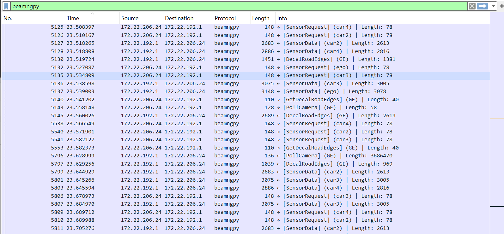

## Debug the BeamNGpy Protocol

To debug the TCP protocol that BeamNGpy uses to talk with BeamNG.tech,
you can use this Wireshark BeamNGpy plugin. It tries to decode messages
on TCP port 25252, which is the default for BeamNGpy. If the plugin finds
a BeamNGpy `StartVehicleConnection` message, it also starts decoding the
TCP communication happening between BeamNG vehicles and BeamNGpy.

You can see an example of the plugin here:

### Installation
1. Install [Wireshark](https://www.wireshark.org/).
2. Copy `beamngpyDissector.lua` and `MessagePack.lua` from this folder into
   the Wireshark folder, which should be `%appdata%/Wireshark/plugins` on a Windows
   system.
3. Start capturing the traffic on corresponding interface, you can then use the filter
   word `beamngpy` to display only messages that were processed by the plugin.